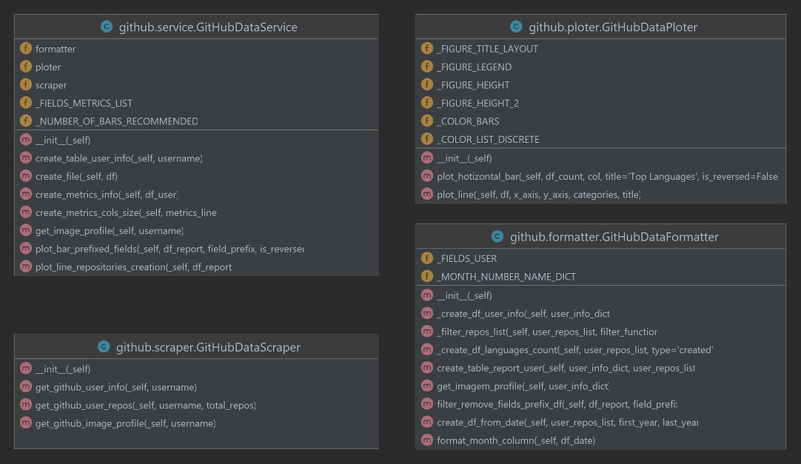

# Streamlit - GitHub Profiles

**Autor: Leonardo Simões**

Para executar o projeto localmente, digite `streamlit run Report.py` no terminal 
e acesse `http://localhost:8501/`.

Para acessar a página do aplicativo: `https://profilegit.streamlit.app/`

## Diagrama de Classes UML do pacote github:

